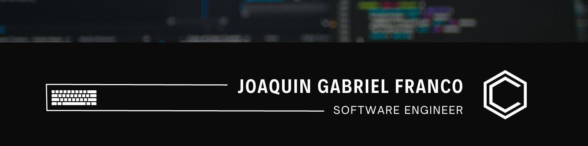

  

## 👋 Overview
🔭 I’m currently working on **Neural Radiance Fields (PyTorch implementation)**  
🌱 I’m currently learning **basics of DevOps**  
📫 How to reach me: **chino.franco@gmail.com**  
⚡ Fun fact: **I play ukulele and love going to the gym**  

## 🔎 About Me

I am a Filipino international student pursuing my undergraduate studies under Nagoya University's G30 Automotive Engineering Program. Currently, I am a student intern at the Fujii Lab (藤井研究室) under the Department of Information and Communication Engineering. I also worked as an intern at Woven Planet Holdings, under the Arene Vertex - Test Beds team. My main interests are Python scripting & development, image processing & computer vision, and infrastructure services. 

## 🌐 Socials:

# 💻 Tech & Tools:

              

# 📊 GitHub Stats:  

  

## ⭐ Project Highlight  
As a member of Fujii Lab, I studied neural radiance fields (NeRF) and its applications. For my senior year research, I attempted to leverage NeRF to generate 3D spatial data of a scene for holography applications.

  

